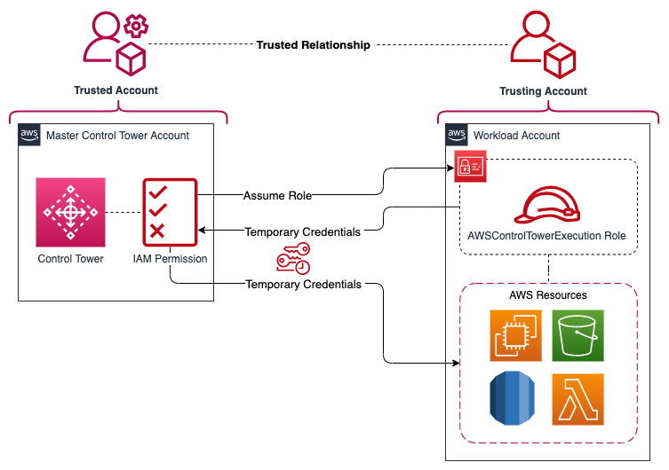

# Control Tower Cross-Account Role

This template creates an IAM role with administrator access and builds a trust relationship with the control tower management/master account. This role can be used to perform a switch role action or to enroll the account into the control tower organization.

## Deployment diagram:



## Role details: 
- Role Name: AWSControlTowerExecution
- Role Permission: AdministratorAccess (AWS managed policy)
- Role Trust Relationship: Management Account ID

## Full Access Policy:

```json
{
    "Version": "2012-10-17",
    "Statement": [
        {
            "Action":"*",
            "Resource":"*",
            "Effect":"Allow",
            "Sid":"AWSControlTowerExecution"
        }
    ]
}
```

## Trust Relationship:

```json
{
    "Version": "2012-10-17",
    "Statement": [
        {
            "Action":"sts:AssumeRole",
            "Effect":"Allow",
            "Principal":{
                "AWS":"arn:aws:iam::XXXXXXXXXX:root"
                }
        }
    ]
}
```